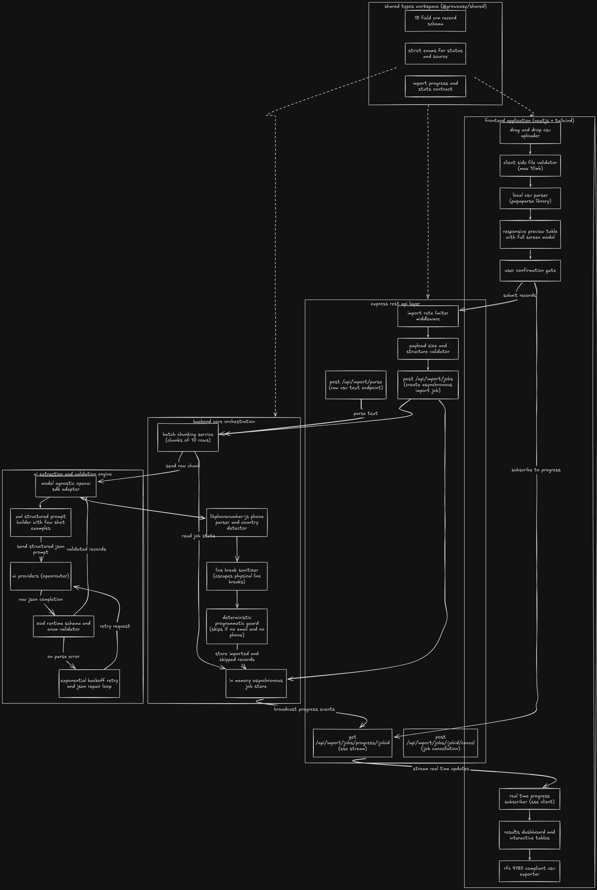

# Groweasy csv importer

It is a tool that takes any csv file whether it's from facebook lead ads, google ads, a real estate crm export, or just a random spreadsheet someone made and uses ai to figure out the column mapping automatically. instead of expecting fixed column names, it sends the rows to an llm which intelligently maps them into the groweasy crm lead format.


## architecture



Here's how the pieces fit together:

- the frontend never talks to the backend directly. it goes through next.js api routes which proxy everything to the express backend. this keeps cors simple and lets us host frontend and backend on completely different domains (like vercel + railway).
- csv parsing happens entirely in the browser using papaparse, no server calls happen until the user actually clicks "confirm import".
- the backend doesn't use a database, it keeps an in-memory job map just for streaming progress updates over server-sent events.
- there's a shared workspace package (`shared/`) that holds all the crm types and enums. this way the frontend, backend, and ai prompt all use the exact same data shape.

## features

**frontend**
- drag and drop csv upload (or click to browse), works with keyboard too
- parses the csv locally and shows a preview table with sticky headers, horizontal and vertical scrolling, and alternating row colors — all before making any api call
- guided multi-step flow: upload → preview → processing → results
- live progress bar that updates batch by batch using server-sent events
- results page with stats cards (imported / skipped / total), color coded status badges, and a separate tab showing why specific rows were skipped
- incremental table rendering for large result sets so it doesn't lag
- toast notifications, loading spinners, empty states, and inline errors with a retry button
- dark mode, fully responsive down to mobile
- the import modal is lazy loaded so the initial page stays fast

**backend**
- accepts any csv column layout — doesn't assume column names are fixed
- splits records into batches (default 20 per batch) and sends them one by one to the llm
- the ai prompt has strict rules: enum constraints for status and source fields, skip rules for invalid rows, and handling for multiple emails or phone numbers in a single cell
- if the ai returns bad json, it retries with exponential backoff (waits 2s, then 4s)
- even if the ai says a record is valid, the backend double checks — any row missing both email and phone number gets force-skipped
- streams real time progress to the frontend via sse
- has centralized error handling with typed error codes, rate limiting (10 requests per minute per ip), and structured json logging

## tech stack

| layer | tech |
|---|---|
| frontend | next.js 14 (app router), typescript, tailwind css, radix ui, lucide-react |
| backend | node.js, express, typescript |
| ai | openai-compatible api — supports groq, openai, gemini, openrouter out of the box |
| validation | zod for runtime schema validation of ai responses |
| phone parsing | libphonenumber-js for country code detection and number normalization |
| tooling | pnpm workspaces, jest (backend tests), eslint |
| deployment | docker (multi-stage builds), vercel (frontend), railway (backend) |

> **why the openai sdk?** the openai sdk is used as a universal adapter. it works with groq (`api.groq.com/openai/v1`), openai directly, gemini via openrouter, and others — all without changing any code. you just swap the api key and base url in the env file.

## prerequisites

- node.js 18 or higher (tested on 20 and 24)
- pnpm 9+ (run `corepack enable` and it'll pick up the right version automatically)
- an api key from any supported provider. easiest free option: [groq](https://console.groq.com/keys)

## setup

```bash

git clone https://github.com/Geethapranay1/crm-lead-exporter.git
cd csv


pnpm install

cp .env.example backend/.env

pnpm build:shared

pnpm dev
```

once it's running:
- frontend: http://localhost:3000
- backend: http://localhost:5000 (hit `/health` to check it's alive)

## environment variables

check [`.env.example`](./.env.example) for the full list. the important ones:

| variable | where | what it does |
|---|---|---|
| `GROQ_API_KEY` | backend |alternative AI provider API key (required) |
| `GROQ_MODEL` | backend | which model to use, defaults to `llama-3.3-70b-versatile` |
| `OPENROUTER_API_KEY` | backend | main i am using openrouter.  |

| `GEMINI_API_KEY` | backend | alternative: use google gemini |
| `BATCH_SIZE` | backend | how many rows to send to the ai per call (default `10`) |
| `MAX_RETRIES` | backend | retry count for failed ai batches (default `2`, with backoff) |
| `CORS_ORIGIN` | backend | allowed origin in production |
| `NEXT_PUBLIC_API_URL` | frontend | backend url, used for display |
| `BACKEND_URL` | frontend | server-side only — where next.js api routes proxy to |

## api documentation

### `POST /api/import`

starts an import job. returns immediately with a job id — the actual processing happens in the background.

**request body**
```json
{
  "headers": ["Full Name", "Email Address", "Phone"],
  "rows": [
    { "Full Name": "John Doe", "Email Address": "john@example.com", "Phone": "9876543210" }
  ],
  "fileName": "facebook_leads_export.csv"
}
```

**response — 202 accepted**
```json
{
  "success": true,
  "data": {
    "jobId": "b3f1...",
    "totalRecords": 128,
    "totalBatches": 7
  }
}
```

### `POST /api/import/parse`

takes raw csv text and parses it into structured headers + rows. useful if you want the backend to handle csv parsing instead of the client.

**request body** — send raw csv text with `content-type: text/csv`, or json `{ "csvText": "..." }`

**response — 200 ok**
```json
{
  "success": true,
  "data": {
    "headers": ["name", "email", "phone"],
    "rows": [{ "name": "john", "email": "john@test.com", "phone": "1234567890" }],
    "totalRows": 1
  }
}
```

### `GET /api/import/progress/:jobId`

server-sent events stream. each event gives you the current state of the job:

```json
{
  "jobId": "b3f1...",
  "status": "processing",
  "currentBatch": 3,
  "totalBatches": 7,
  "processedRecords": 40,
  "totalRecords": 128,
  "message": "processing batch 3 of 7..."
}
```

when `status` becomes `"completed"`, the payload includes the full result:
```json
{
  "result": {
    "imported": [{ "name": "john doe", "email": "john@example.com", "...": "..." }],
    "skipped": [{ "index": 5, "reason": "no valid email or mobile number found", "original_data": {} }],
    "stats": { "total": 128, "imported": 120, "skipped": 8 }
  }
}
```

### `POST /api/import/:jobId/cancel`

cancels a running import job immediately.

### error codes

| code | status | what it means |
|---|---|---|
| `INVALID_FILE` | 400 | missing headers/rows, empty csv, file too large |
| `RATE_LIMITED` | 429 | too many import requests from this ip |
| `AI_ERROR` | 502 | ai extraction failed even after retries |
| `NOT_FOUND` | 404 | that job id doesn't exist |
| `INTERNAL_ERROR` | 500 | something unexpected broke |

## how the ai mapping works

the prompt lives in `backend/src/prompts/field-mapping.prompt.ts`. here's what it does:

1. **defines the exact output shape** — the ai must return one crm record per input row, in the same order, matching a strict 15-field json schema.

2. **locks down the enums** — `crm_status` can only be one of `GOOD_LEAD_FOLLOW_UP`, `DID_NOT_CONNECT`, `BAD_LEAD`, or `SALE_DONE` (or blank). `data_source` can only be one of `leads_on_demand`, `meridian_tower`, `eden_park`, `varah_swamy`, or `sarjapur_plots` (or blank). if the ai isn't confident, it leaves the field empty.

3. **handles multiple emails and phones** — if a cell has two email addresses, the first one goes into the `email` field and the second gets appended to `crm_note` as "alt email: ...". same logic for phone numbers.

4. **infers data source from context** — it checks the filename and cell content for keywords. for example, if the filename is "meridian_leads.csv", it maps `data_source` to `meridian_tower`.

5. **escapes line breaks** — any newline character inside a field value gets escaped as `\n` so the record stays as a single csv row.

6. **skip rule** — if a row has neither an email nor a phone number, the ai marks it as skipped. but even if the ai misses this, the backend has its own check that catches it programmatically.

7. **date handling** — `created_at` must be parseable by javascript's `new Date()`. this is enforced both in the prompt and by a zod schema validator on the backend.

each batch goes out with `temperature: 0` and `response_format: json_object` so the output is deterministic and parseable. if the json comes back broken, the backend cleans up common issues (like markdown code fences) and retries up to `MAX_RETRIES` times with exponential backoff. a single bad batch never kills the whole import — those rows just get marked as skipped with a clear reason.

## testing

```bash

cd backend && pnpm test
```

what's tested:
- csv text parsing (handles bom, quoted fields, empty rows)
- zod schema validation (rejects invalid statuses, bad dates, etc.)
- batch processing logic (chunking, skip detection, progress updates)
- ai service (response cleaning, json repair, retry behavior — with the llm client mocked)

## docker

```bash

cp .env.example .env 
docker compose up --build
```

- frontend → http://localhost:3000
- backend → http://localhost:5000

each service has its own multi-stage dockerfile that builds the shared package first, then the app, and ships a minimal `node:20-alpine` runtime image.

## deployment

- **frontend → vercel**: import the repo, set root directory to `frontend`, add `NEXT_PUBLIC_API_URL` and `BACKEND_URL` as env vars pointing at your deployed backend. there's a `vercel.json` in the frontend folder that handles the monorepo build.
- **backend → railway or render**: point the service at `backend/Dockerfile`. set `GROQ_API_KEY` (or whichever provider key you're using), `CORS_ORIGIN` (your vercel url), and the other env vars from `.env.example`. there's a `railway.toml` included for railway.

## project structure

```
groweasy-csv-importer/
├── shared/types/index.ts          # crm types, enums, and api contracts (shared across all packages)
├── backend/src/
│   ├── index.ts                   # express app entry point
│   ├── routes/import.routes.ts    # api route definitions
│   ├── controllers/               # request handlers
│   ├── services/
│   │   ├── ai.service.ts          # model-agnostic llm adapter (openai sdk)
│   │   ├── batch.service.ts       # batch orchestration, record sanitization
│   │   ├── csv.service.ts         # csv parsing, row normalization, chunking
│   │   └── job-store.service.ts   # in-memory job state and sse broadcast
│   ├── prompts/
│   │   └── field-mapping.prompt.ts  # the ai extraction prompt with few-shot examples
│   ├── middleware/                 # error handling, payload validation, rate limiting
│   ├── utils/                     # logger, phone parser, zod schemas
│   └── __tests__/                 # jest test suites
└── frontend/src/
    ├── app/                       # next.js app router pages + api proxy routes
    ├── components/
    │   ├── ui/                    # reusable ui components (button, modal, table, etc.)
    │   ├── csv-import/            # dropzone, csv preview, parsed results, import modal
    │   └── layout/                # sidebar, header, dashboard shell
    ├── hooks/                     # useCsvParser, useImport, useToast
    └── lib/                       # csv parser, api client, utility helpers
```

## future improvements

- hook up a real database instead of keeping everything in memory
- move csv parsing to a web worker for very large files so the ui stays smooth
- add a column mapping confirmation screen where users can override the ai's guesses before importing
- let users retry individual failed batches from the results page instead of restarting the whole job
- add authentication and multi-tenant workspaces

## license

MIT
